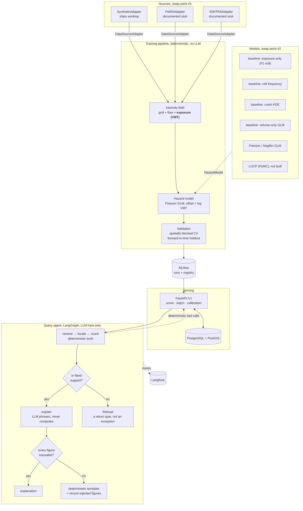

# Architecture

## System

Four layers, two of them replaceable through a `Protocol`. Everything between
the adapter and the API is written against
[`DataSourceAdapter`](src/born_field/adapters/base.py) and
[`HazardModel`](src/born_field/models/base.py) and against nothing else.

## Decision log

### D1. Poisson GLM as the primary model, not gradient boosting

An offset with a coefficient *fixed at 1* is the structural core of the whole
project, and it is not expressible in a standard GBM, you can pass exposure as
a feature and hope the model learns the unit slope, but hoping is not an
identification strategy. The GLM also yields analytic standard errors, so
intervals come free instead of from an expensive bootstrap, and every
coefficient is directly interpretable, which matters when a compliance team asks
why a cell scored the way it did. Marginal predictive gain from boosting does not
outweigh losing the offset, the intervals, and the interpretability at once.
Boosting is evaluated as a challenger and registered as such.

### D2. PostGIS, not GeoParquet + DuckDB

Honest version: at this data volume, GeoParquet with DuckDB would be faster and
simpler for the analytics, and if the deliverable were a study, that is what
should ship. Postgres earns its place on the *serving* side, concurrent
low-latency point queries against a spatial index, mutable state, and a
transactional store for scoring jobs and audit records. Choosing it is a
statement about production posture, not about analytical throughput. Batch
experiment artefacts stay on the filesystem; nothing forces them through the
database.

### D3. LangGraph over the query path only

The training pipeline (ingest → field → fit → validate) is a deterministic DAG
with no decision points an LLM could usefully influence. Expressing it as an
agent graph would produce a job runner wearing a costume. LangGraph is applied
where branching genuinely depends on runtime judgement, the query path, where
the graph must decide between explaining a prediction and refusing to make one,
and where the explanation is natural language. Plain typed Python runs the rest.

The LLM never produces a number. Every figure in an explanation traces back to a
deterministic tool output, and the eval suite in CI asserts exactly that.

### D4. Refusal as a return type

`ScoringResult = HazardEstimate | Refusal`. Out-of-coverage requests are not
exceptions, because "we do not know" is a legitimate, commercially meaningful
answer that callers must be able to branch on, and because an exception path is
the easiest place for a silent extrapolation to hide. Insufficient coverage,
out-of-region coordinates, out-of-range timestamps, and missing exposure are
distinguishable at the type level.

### D5. Protocols, not abstract base classes

A buyer with an existing internal telematics client should satisfy the adapter
contract structurally, without inheriting from our package. `runtime_checkable`
plus `mypy --strict` gives static enforcement and a cheap runtime assertion at
the plug-in boundary.

### D6. Ground truth is isolated from the fitting path

`GeneratorConfig` holds the answer key (`true_alpha`, `true_k`, the multipliers).
Nothing downstream of the generator is permitted to read it; the recovery
experiment compares fitted output against it only at reporting time. Leakage
here would invalidate the single headline result, so it is a structural
separation, not a convention.

### D7. Misspecification sweep, not clean recovery

Recovering α from an uncorrupted Poisson sample is guaranteed by
maximum-likelihood consistency; publishing it as a result would be publishing a
unit test for `statsmodels`. `CorruptionConfig` defines the regimes that make
recovery informative, measurement error on flow, spatially varying
underreporting, aggregation mismatch, omitted covariates, overdispersion, and
the flagship plot is recovered-α against true-α with one curve per regime and
the clean case as the control.

### D8. Metric hierarchy: deviance first

The target is a rate, so held-out Poisson deviance is primary. PR-AUC requires
binarising counts, which discards information and imports prevalence dependence
that makes it incomparable across spatial folds. It is retained only for the
top-N hotspot ranking use case, reported per fold and pooled.

### D9, argparse over Typer, stdlib over convenience

The CLI is an operator surface for a handful of pipeline stages. Revisit above
roughly eight subcommands.

### D10. The analysis unit is (cell, road_class), not the cell

Worth the refactor when I hit it. A cell is mixed: a typical one
holds a little motorway and a lot of residential street. Collapsing that to a
"dominant class" labelled 80 of 81 cells residential, because residential
carries most centre-line mileage in any real city, left the class effect
unidentifiable.

Worse, it is not merely uninformative but *wrong*: the hazard law applies per
class, with a different flow and multiplier on each, so collapsing them averages
two distinct processes and introduces the very aggregation bias this project
sets out to measure. Splitting by stratum gives every class its own
well-populated support. Spatial identity stays on `cell_id`, so blocking and
PostGIS indexing are unaffected.

### D11. Panel-level validation, not per-row

Models are fitted on a `HazardPanel` whose schema is validated once on
construction. `HazardSample` remains the right shape for scoring one cell-window
through the API, but the recovery experiment fits hundreds of models over ~10^6
rows, and constructing that many validated objects per fit would dominate its
runtime while proving nothing extra. The same trade every production feature
store makes.

The adapter contract keeps the row-wise, lazy `Iterable` form, it is what a
buyer implements, with `VectorisedSource` as an *optional* fast path that
callers detect with `isinstance`.

### D12. Numeric verification over prompt discipline

"The model was instructed not to invent numbers" is a hope, not a control, and in
a product whose numbers are prices it is a liability. Every tool records its
numeric outputs into typed state, and a verifier mechanically checks that each
figure in the generated prose traces back to one, within a single auditable
tolerance constant. Failure replaces the prose with a deterministic template and
records what was rejected.

Building the adversarial cases found three defects in the verifier itself
(zero-decimal rounding authorising 17% errors; `is_integer()` exempting a
fabricated "2.0"; the number regex consuming sentence-ending full stops). The
residual gap, a fabricated bare integer at or below 100, is documented in the
module. A verifier is not a proof.

### D13. MLflow on SQLite, not the filesystem store

MLflow has put its filesystem backend into maintenance mode and it now raises
rather than degrading. SQLite is a supported backend that keeps the
zero-credentials property.

### D14. Open decisions

* **`rasterio` was dropped.** It would earn a place only if the intensity field
  were exported as GeoTIFF for interoperability. Figures are matplotlib PNGs and
  the field is served through the API, so it never justified its dependency
  weight. Reinstate if raster interchange becomes a buyer requirement.
* **Licence** is MIT for reach. Apache-2.0 is the alternative if an explicit
  patent grant matters more than brevity.
* **Spatial random effect** (penalised spline or CAR term) remains deferred, and
  the deferral now has evidence behind it. D7's omitted-covariate regime
  quantified the confounding: dropping two class strata biases α by −0.159 with
  zero interval coverage. That is large enough to justify the term, so this is
  the highest-value next increment, but it must be validated *under spatial
  blocking*, since a smoothing hyperparameter tuned on random folds would inherit
  exactly the optimism D8 rejects.

* **Errors-in-variables correction.** F5 fires: detector noise at σ=0.3 drives α
  below 1. A SIMEX or regression-calibration correction, or a validated-subset
  design, is required before this pipeline can be pointed at PeMS. Currently a
  documented limitation with a measured magnitude.

## Data flow invariants

Enforced in code, not by convention:

1. **Exposure is an offset.** Any model estimating a free coefficient on
   exposure is modelling counts, not risk. Asserted in the model contract.
2. **Geometry maths happens in a projected CRS.** Storage is EPSG:4326; every
   length and area computation happens in EPSG:3310 (California Albers, equal
   area, metres). Degrees are not a unit of distance.
3. **Time windows are half-open and UTC-aware.** Consecutive windows tile the
   timeline without double-counting exposure at boundaries.
4. **Reporting is distinguished from occurrence.** `CrashObservation.reported`
   and `FlowObservation.imputed` survive all the way through the pipeline,
   because both are bias sources and both are unrecoverable once dropped.
