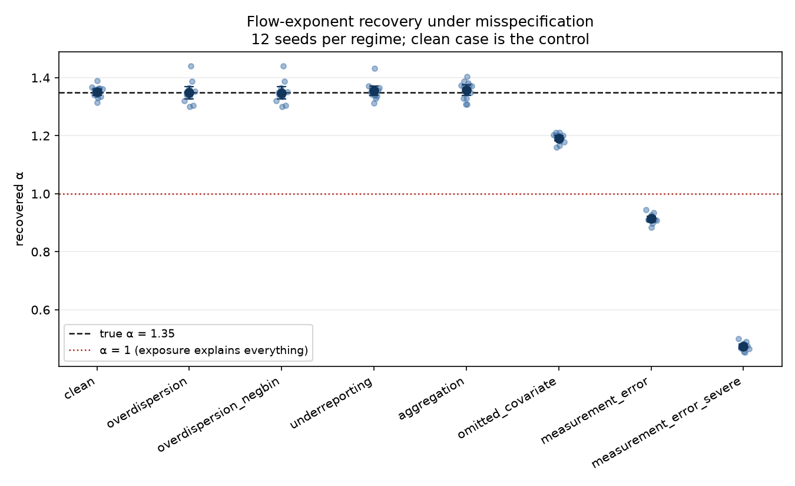
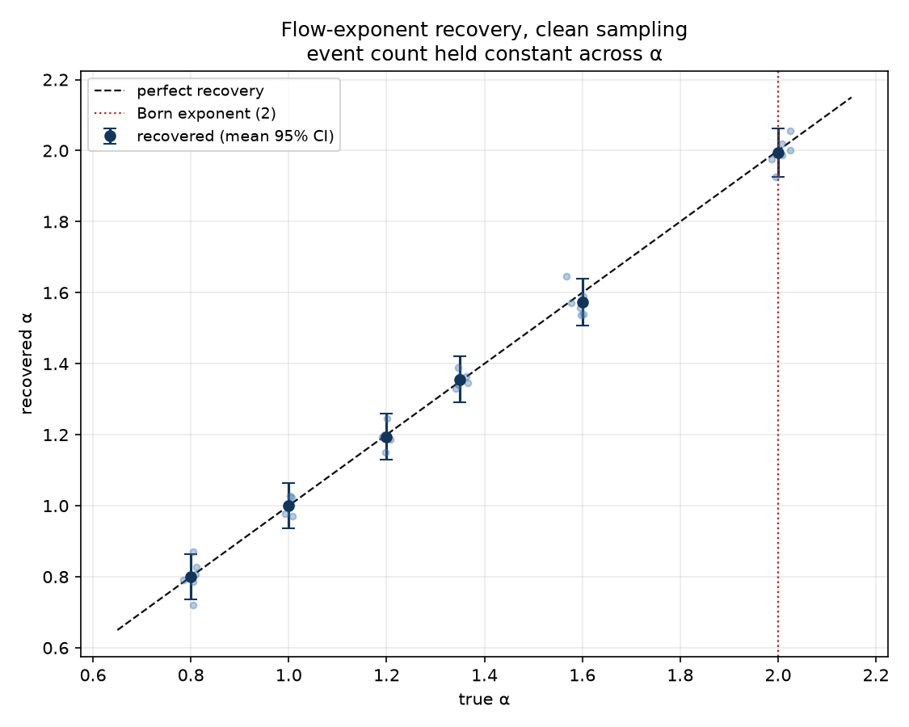

# Born Field

**Geospatial collision risk intelligence.** An ingestion → intensity-field →
hazard-model → calibrated-risk-API pipeline in which the data source and the
hazard model are swappable. Runs end to end with zero credentials.

The product is the pipeline and the validation rigour, not the numbers. The
numbers here come from a simulator, and the most useful result is a **negative**
one: the conditions under which this pipeline lies to you, measured.

```bash
uv sync --all-extras --dev
make check                       # lint, type-check, test
uv run bornfield experiment      # the flagship result, ~10 min
uv run bornfield serve           # API at localhost:8000/docs
```

Full runbook with verified output: [RUNNING.md](RUNNING.md).

---

## The headline result

The synthetic generator samples collisions from a known hazard law with a
configured flow exponent α that the fitting code never sees:

```
E[collisions] = k · flow^α · road_class · weather · time_of_day · road_miles · hours
```

Recovering α from *clean* samples is guaranteed by maximum-likelihood
consistency, publishing it would be publishing a unit test for `statsmodels`.
So the clean case is the control, and the reported result is how recovery
degrades under the failure modes real data actually has.

**12 seeds per regime, true α = 1.35, event count held constant at ~5,000:**

| Regime | Recovered α | Bias | Interval coverage | Held-out deviance |
| --- | --- | --- | --- | --- |
| clean *(control)* | 1.351 | +0.001 | 12/12 | 0.052 |
| overdispersion | 1.349 | −0.002 | 11/12 | 0.052 |
| spatial underreporting | 1.355 | +0.005 | 11/12 | 0.039 |
| aggregation (2× cells) | 1.357 | +0.007 | 12/12 | **0.114** |
| omitted covariates | 1.191 | **−0.159** | 0/12 | 0.052 |
| detector noise σ=0.3 | **0.914** | **−0.436** | 0/12 | 0.052 |
| detector noise σ=0.6 | **0.474** | **−0.876** | 0/12 | 0.053 |



Three things worth reading off this table.

Detector measurement error is catastrophic, and it is the regime most likely
to be present in a real deployment. At σ = 0.3, well within what loop-detector
imputation produces, the recovered exponent falls *below 1*. A user would
conclude that risk per vehicle-mile **decreases** with traffic density, the exact
opposite of the truth. This fires pre-registered failure condition F5.

The mechanism is derived, not merely observed. Because observed flow enters
both the offset and the covariate, the attenuation applies to the whole
exponent: **α̂ = α·λ**, with λ the reliability ratio of log flow. The
subtlety that makes it so severe is *which* variance enters λ. Marginal
`var(log flow)` is 1.89, but the road-class dummies absorb nine tenths of it,
leaving **0.21** of identifying within-class variation. Predicted α̂ of 0.946 and
0.498 against observed 0.914 and 0.474. A test pins this relationship, so the
fragility is a property of the model, not an anecdote.

Bias and interval coverage fail independently. Aggregation leaves α almost
unbiased while more than doubling held-out deviance. The parameter survives; the
predictions do not. Overdispersion moves neither, because with events this rare
Poisson sampling noise swamps rate-level extra variance; a negative-binomial fit
returns the same answer. That is a limitation of the diagnostic, and I report it as one.

### Is Born's exponent of 2 the right one?

No, and that is the point. α is a **hypothesis under test**, not a constant
inherited from physics. Across a sweep of true values from 0.8 to 2.0 at constant
event count, the pipeline recovers whatever α generated the data, including
α = 1.0, where it correctly reports that the intensity field adds nothing.

**6 seeds per point, event count held constant:**

| True α | Recovered α | SD | Interval covers truth |
| --- | --- | --- | --- |
| 0.80 | 0.801 | 0.050 | 4/6 |
| 1.00 | 1.001 | 0.024 | 6/6 |
| 1.20 | 1.194 | 0.030 | 6/6 |
| 1.35 | 1.356 | 0.021 | 6/6 |
| 1.60 | 1.574 | 0.041 | 6/6 |
| 2.00 | 1.995 | 0.043 | 5/6 |

Aggregate interval coverage is **33/36 = 91.7%** against a nominal 95%. With 36
draws the binomial interval around a true 95% rate spans roughly 83–99%, so this
is consistent with correct coverage. But 36 draws cannot distinguish 92% from 95%, and the honest reading is "no detectable
miscalibration", not "calibrated to within 3 points". Establishing the latter
would need a few hundred seeds.



Traffic has no complex amplitudes, no interference, and no superposition. The
only idea borrowed from Born's reading of |ψ|² is structural: *field intensity
maps to event likelihood*. Nothing in this repository is physics.

---

## The exposure confound

*The first thing a competent reviewer will probe, and the reason most published
"crash risk maps" are traffic-volume maps with a new legend.*

More traffic produces more crashes almost tautologically. A model fitted to raw
counts rediscovers the volume map and calls it risk. It will confidently report
that the busiest interchange in the county is the most dangerous place to drive, true in total incidents, and useless for prioritising spending, pricing a policy,
or routing a vehicle.

The fix is to model the **rate per vehicle-mile**, with exposure entering the
Poisson model as an offset whose coefficient is *fixed at 1*:

```
log E[crashes] = log(VMT) + b0 + b1·log(flow) + b·covariates
                 ^^^^^^^^
                 offset, not a fitted coefficient
```

where `VMT = flow × road_miles × window_hours`. Road mileage is part of the
denominator, not an afterthought: two cells with identical flow but different
road mileage do not carry the same crash opportunity.

**Flow appears on both sides deliberately, and that is the identification
strategy.** The offset supplies exactly one power of flow, so the free
coefficient b1 estimates **α − 1**:

| Estimate | Meaning |
| --- | --- |
| b1 = 0 (α = 1) | Risk is *purely* exposure-driven. The field adds nothing. |
| b1 > 0 (α > 1) | Risk per vehicle-mile rises with density, congestion effect. |
| b1 < 0 (α < 1) | Risk per vehicle-mile falls with density, "safety in numbers". |

The null hypothesis has a coefficient of exactly zero attached to it, which is
what makes it testable rather than rhetorical.

### The trap this creates, which is the opposite of the obvious one

The generator makes motorways *safer* per vehicle-mile than residential streets
(multipliers 0.6 vs 1.8). But since `rate/VMT = k · flow^(α−1) · class` and
α > 1, and motorways carry ~45× the flow, the density term `45^0.35 ≈ 3.8`
**overwhelms** the 0.33 class-safety ratio.

So raw crashes-per-vehicle-mile ranks the safest roads as the most dangerous, arithmetically correct and operationally worthless. The class effect is a
*conditional* statement, true only at fixed flow. Both directions are pinned by
tests, because the model must reproduce the first and a naive analysis will
report the second.

### Two identifiability caveats, checked in code

1. α and the offset separate only if flow has real spread. Enforced in the
   generator; a real adapter must assert it.
2. α is **not** scale-invariant (the modifiable areal unit problem). Cell size is
   recorded with every run and is one of the tested regimes.

---

## Baselines, and why the hotspot map loses

A result without a baseline proves nothing. All four are scored by *the same
harness code* as the candidate model, a model evaluated by bespoke code is a
model evaluated on its own terms.

| Model | What it claims | Held-out deviance | Hit-rate @ top 5% |
| --- | --- | --- | --- |
| Poisson hazard GLM | risk per vehicle-mile | **best** |, |
| exposure-only (F1 null) | one rate everywhere | 0.0511 | 0.252 |
| historical frequency | past crashes repeat | 0.0512 | 0.252 |
| volume-only GLM | counts ~ traffic | 0.0528 | 0.198 |
| crash KDE (hotspot map) | crashes cluster | 0.0941 | **0.063** |

The KDE hotspot map, the form most published crash-risk maps take, is the
*worst* model here, and its top 5% of cells contains 6.3% of collisions against
the 5% a random ranking achieves. It has no exposure denominator, so it cannot
distinguish a dangerous road from a busy one.

## Validation, and why random k-fold is invalid

Crash and flow surfaces are strongly spatially autocorrelated. A random fold puts
a cell's immediate neighbours in training and the cell itself in test, so the
model *interpolates between adjacent observations* rather than generalising. No
deployment is ever handed the neighbours of the cell it must score.

Random k-fold is therefore not offered as a usable splitter. It exists only as
`random_split`, named `INVALID`, so that a test can **demonstrate** the optimism
in the project's own numbers instead of asserting it.

- **Spatially blocked CV**, whole blocks held out, so test cells have no
  training neighbours.
- **Forward-in-time holdout**, train on the past, score the future, because
  that is all deployment ever does.

Primary metric is **held-out Poisson deviance**: the target is a rate, and
binarising to compute a classification metric discards the count. PR-AUC and
hit-rate @ top-N are secondary, for the hotspot-ranking use case, reported per
fold and pooled. PR-AUC is prevalence-dependent and not comparable across folds
with different crash densities.

## Pre-registered failure conditions

Written before any model existed. `git log` is the proof.

| | Condition | Outcome |
| --- | --- | --- |
| **F1** | Interval for α covers 1 *and* the model cannot beat the exposure-only GLM → the field adds nothing | **passes** |
| **F2** | Clean α outside ±5% of truth, or coverage far below nominal → wiring bug | **passes** (1.351 vs 1.35; 12/12) |
| **F3** | Fails to beat all baselines on held-out deviance → ship the baseline instead | **passes** |
| **F4** | Interval coverage outside [0.90, 0.98] or ECE > 0.05 → the calibration claim dies | **passes** |
| **F5** | Bias in α > 20% under realistic detector noise → unusable on real data without an errors-in-variables correction | **FIRES** (−32% at σ=0.3) |

F5 firing is the most valuable output in the repository. It converts "this
pipeline works" into "here is exactly what would have to be true of your data for
this pipeline to work."

## Calibration is the product

A risk score no one can price against is worthless, so every estimate returns a
calibrated probability *and* an uncertainty interval, and the API exposes the
calibration report as a first-class endpoint (`GET /v1/calibration`). Intervals
come from propagating uncertainty through the log link, so they stay strictly
positive and asymmetric, the right shape for a rate near
zero, and the shape an actuary expects.

## Refusal is a return type

`ScoringResult = HazardEstimate | Refusal`. An API that answers every question is
*less* useful than one that declines, because the caller cannot tell which
answers to trust. Four refusal reasons are distinguished, because a caller does
something different about each: out-of-region needs a different deployment,
out-of-time-range needs a refit, thin coverage needs more data collection, and
out-of-support flow needs a human.

Refusals return **HTTP 200**. Routing a computed answer into a client's error
handler would get it logged as a failure and retried, which is the wrong response
to "we do not have enough data here."

## The agent layer

LangGraph is applied to the **query path only**, score → explain → refuse, where branching genuinely depends on runtime judgement. The training pipeline
stays plain typed Python, because a deterministic DAG expressed as an agent graph
is a job runner in costume.

The LLM does not invent numbers, and that is enforced in code.
Every tool records its numeric outputs into typed state; a verifier then checks
that every figure in the generated prose traces back to one of them within a
single auditable tolerance. An explanation that fails verification never reaches
the caller, it is replaced by a deterministic template and the rejected figures
are recorded. That fallback is what makes the guarantee unconditional.

The golden-set eval suite runs in CI **without an API key**: it asserts refusal
routing and that no fabricated figure survives verification. Adversarial cases
include a made-up rate, an invented ratio, and the most dangerous shape, a
correct point estimate wrapped in a narrower interval than the model supports.
Writing those cases found three real defects in the verifier (see
`agent/verification.py`), and its residual gap is documented there.

## Architecture

Four layers, two replaceable through a `Protocol`:

```
DataSourceAdapter ──▶ intensity field ──▶ HazardModel ──▶ calibrated API
   swap point #1                          swap point #2
```

See [ARCHITECTURE.md](ARCHITECTURE.md) for the system diagram and the full
decision log. Highlights: Poisson GLM over gradient boosting (a coefficient
*fixed* at 1 is not expressible in a GBM), PostGIS for serving posture rather
than analytics throughput, and Protocols over ABCs so a buyer satisfies the
contract structurally.

| Not used | Why |
| --- | --- |
| Kubernetes | One stateless service and one database. Compose expresses the whole topology. |
| Kafka | Ingestion is batch by nature, crash records arrive with days of reporting lag. |
| JS frontend | The deliverable is an API and a validation report. |
| RAG / fine-tuning | The LLM explains deterministic tool outputs. No corpus, no behaviour worth distilling. |
| XGBoost as primary | Loses the offset, the analytic intervals, and interpretability at once. Evaluated as a challenger. |

## Legal and ethical scope

Geographic risk scoring is adjacent to redlining and predictive policing, and in
California is constrained by Proposition 103 rating-factor rules.
[MODEL_CARD.md](MODEL_CARD.md) states intended and out-of-scope uses, the
crash-report bias analysis with measured magnitudes, and the enforcement feedback
loop. In short: **infrastructure prioritisation is defensible; individual pricing
and enforcement targeting are out of scope**, and the distinction is a design
property.

## Documentation

| Document | What it covers |
| --- | --- |
| [RUNNING.md](RUNNING.md) | Full runbook: install, tests, the experiment, the API, Docker. Every command executed and every response body observed. |
| [ARCHITECTURE.md](ARCHITECTURE.md) | System diagram and the decision log (D1–D14). |
| [MODEL_CARD.md](MODEL_CARD.md) | Intended and out-of-scope uses, measured biases, regulatory context. |
| [docs/adapters.md](docs/adapters.md) | Writing a data-source adapter: the contract and its four hard requirements. |

## Repository layout

```
src/born_field/
  types.py            domain contract, immutable, unit-explicit, validated
  config.py           grid / generator ground truth / corruption regimes
  adapters/           DataSourceAdapter Protocol + SyntheticAdapter  ← swap #1
  field/              road network, grid, (cell × road_class) strata
  models/             HazardModel Protocol, GLM, four baselines       ← swap #2
  evaluation/         splits, metrics, shared scoring harness
  experiments/        alpha-recovery sweep + MLflow tracking
  api/                FastAPI service, refusal enforcement
  agent/              LangGraph query graph + numeric verifier
  db/                 PostGIS schema and repositories
bruno/                API collection with assertions
```

## Data provenance

**No real collision data is used. No number here describes a real place.**
Results come from a synthetic generator running over a procedurally generated
road network with realistic topology. `scripts/fetch_osm_extract.py` swaps in a
real OSM extract with one command and changes nothing downstream. PeMS and SWITRS
adapters are documented stubs.

## Licence

MIT. See [LICENSE](LICENSE).
